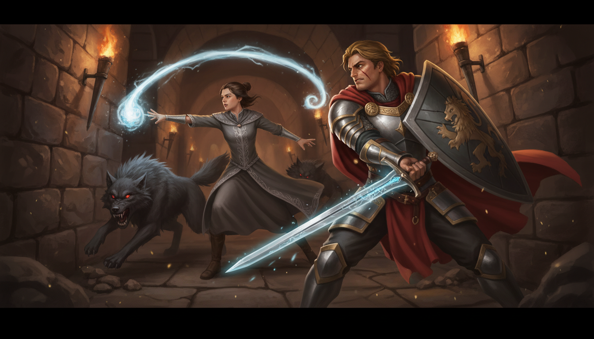

소굴 입구는 바위 사이의 갈라진 틈이었다.

안쪽에서 축축한 짐승 냄새가 올라왔다. 늑대의 울음소리는 멈추지 않았다. 낮은 으르렁거림이 바위 사이로 울려 퍼졌고, 그 사이사이에 발톱이 땅을 긁는 소리가 섞였다.

가렌이 등에서 롱소드를 뽑으며 왼팔에 카이트 실드를 걸었다. 목 뒤를 한 번 톡 두드린 뒤, 입구를 향해 섰다.

"내가 앞에 선다. 넌 뒤에서 쏴."

"잠깐." 카이렌이 입구의 폭을 눈으로 쟀다. 성인 둘이 나란히 서면 꽉 찰 정도. "입구가 좁으니까 한 번에 둘 이상 못 나옵니다. 당신이 입구를 막고, 내가 틈새로 볼트를 넣으면—"

"복잡하게 말하지 마." 가렌이 검을 어깨에 걸쳤다. "막으면 쏴. 그거지?"

"...네. 그겁니다."

가렌이 웃었다. 처음 보는 웃음이었다 — 전투를 앞두고 웃는 사람은 두 종류다. 미쳤거나, 자신이 있거나.

둘 다였을지도 모른다.

***

안쪽은 생각보다 넓었다.

입구를 지나면 동굴이 갑자기 열리며 자연 공동이 나왔다. 천장에서 물이 뚝뚝 떨어졌고, 그 아래에 늑대가 있었다.

스무 마리.

"F등급 의뢰에 스무 마리." 가렌이 낮게 중얼거렸다. "길드 조사반 짤라야 되는 거 아니냐."

늑대들이 일제히 고개를 돌렸다. 스무 쌍의 황금빛 눈이 어둠 속에서 빛났다. 선두의 늑대가 이빨을 드러내며 으르렁거렸고, 그 소리를 신호처럼 무리가 움직이기 시작했다.

"온다!"

가렌이 앞으로 나서며 방패를 들었다. 첫 번째 늑대가 뛰어올랐고, 방패에 부딪히며 탁, 하는 둔탁한 소리가 울렸다. 가렌의 발이 한 뼘 밀렸지만 버텼다. 검이 수평으로 휘둘러지며 늑대의 옆구리를 갈랐다.

"**에너지 볼트**!"

카이렌이 가렌의 어깨 너머로 볼트를 쏘았다. 하얀 빛이 날아가 두 번째 늑대의 이마에 명중 — 했지만 빗나갔다. 볼트가 늑대의 귀를 스치고 뒤쪽 바위벽에 부딪혀 산산이 흩어졌다.

"어디 쏘는 거야!"

"움직여서—"

세 번째 늑대가 가렌의 옆으로 파고들었다. 가렌이 방패를 옆으로 밀쳐 늑대를 날렸지만, 그 틈에 네 번째가 뒤에서 뛰어들었다. 검과 방패가 동시에 두 방향을 막으면서 가렌의 자세가 흐트러졌다.

*리듬이 있다.*

카이렌은 가렌의 움직임을 관찰했다. 방패로 막고, 검으로 베고, 다시 방패를 올리는 3박자. 막-베-올림. 막-베-올림. 검이 내려가는 순간 방패가 올라오기까지 약 1초의 빈틈이 있다.

거기다.

"**에너지 볼트**!"

가렌의 검이 늑대를 벤 직후, 방패가 올라오기 전 — 열린 시야로 볼트가 날아갔다. 다섯 번째 늑대의 목에 정확히 박혔다. 늑대가 비명을 지르며 쓰러졌다.

가렌이 힐끗 뒤를 돌아보았다. 아무 말 없이 다시 앞을 봤지만, 방패를 드는 타이밍이 미세하게 변했다. 검을 벤 뒤 방패를 올리기 전, 일부러 반 박자 늦추는 것처럼.

*이 사람, 알아챘다.*

카이렌의 볼트가 지나갈 틈을 만들어주고 있었다.

막-베-볼트-올림. 막-베-볼트-올림.

새로운 리듬이 맞아들어갔다.

늑대가 한 마리씩 쓰러졌다. 가렌의 검이 앞을 쳤고, 카이렌의 볼트가 옆을 쳤다. 완벽하지 않았다 — 카이렌의 볼트는 세 번에 한 번은 빗나갔고, 가렌의 발은 점점 뒤로 밀렸다. 하지만 무너지지는 않았다.

스무 마리를 줄이는 데 10분이 걸렸다. 가렌의 서코트에 늑대의 피가 튀어 있었고, 카이렌의 손가락 끝이 마나 소모로 차가워져 있었다.

"열다섯." 가렌이 검에 묻은 피를 털었다. "나쁘지 않은데."

카이렌은 대답 대신 남은 마나를 가늠했다. 에너지 볼트 시전 횟수 — 열네 번. 명중 열 번. 명중률 약 70%. 아카데미 실습에서는 정지 표적에 90%를 넘겼지만, 움직이는 늑대 상대로는 이 정도가 한계였다.

"안쪽에 더 있을 수 있어요."

"알아. 가자."

***

소굴 안쪽은 좁아졌다가 다시 넓어졌다.

두 번째 공동에 남은 늑대 다섯 마리가 있었고, 같은 리듬으로 정리했다. 가렌이 막고, 카이렌이 쏘고. 처음보다 확연히 빨라졌다.

문제는 그 뒤에 있었다.

세 번째 공동. 자연 동굴이 아니라 누군가 파낸 듯한 정방형의 공간이었다. 벽에 이끼가 끼어 있었고, 바닥에 깨진 석재 파편이 흩어져 있었다.

그리고 중앙에 — 돌로 된 거인이 서 있었다.

골렘.

높이 3미터. 거친 화강암으로 이루어진 몸체. 머리가 없고, 가슴 부위에 희미한 마법진이 빛나고 있었다. 오래전에 이 동굴을 지키도록 만들어진 수호 골렘인 듯했다. 늑대들이 소굴로 쓰면서 어째서인지 깨어나지 않았던 것이, 전투의 진동으로 활성화된 모양이었다.

골렘이 팔을 들었다. 바위 주먹이 천장을 긁으며 내려왔다.

가렌이 방패를 올렸다.

쾅.

방패가 버텼다. 하지만 가렌의 무릎이 꺾이며 바닥에 금이 갔다. 한 번 더 맞으면 팔이 부러질 충격이었다.

"물리가 안 먹혀!" 가렌이 이를 악물었다. 검으로 골렘의 다리를 베었지만 칼날이 바위 표면에서 미끄러졌다. 불꽃만 튀었다.

*생각해.*

카이렌은 뒤로 물러서며 골렘을 관찰했다. 돌 몸체. 머리 없음. 가슴의 마법진이 동력원 — 아니, 그건 외부 표식일 뿐이다. 아카데미에서 배운 골렘 구조론. 코어는 가장 두꺼운 부위에 숨겨진다. 가슴이 아니라—

골렘이 다시 팔을 들었다. 들어올리는 순간, 왼쪽 어깨 뒤쪽의 이음새에서 미세한 빛이 깜빡였다.

*거기다.*

"가렌 씨! 왼쪽 어깨 뒤쪽, 3초만 버텨요!"

가렌이 방패를 비스듬히 세웠다. 골렘의 주먹이 방패 위를 미끄러지며 옆으로 빠졌다. 완전한 방어가 아닌 흘리기 — 기사단에서 배운 기술이었다.

골렘이 팔을 휘두르며 자세가 열렸다. 왼쪽 어깨 뒤쪽이 드러나는 순간.

"**에너지 볼트**!"

카이렌은 남은 마나를 쥐어짜며 볼트를 집중시켰다. 하얀 빛이 골렘의 왼쪽 어깨 뒤 이음새에 정확히 박혔다.

갈라지는 소리가 났다. 바위 사이에서 주먹만 한 수정 — 코어가 금이 가며 빛을 잃었다. 골렘의 움직임이 멈추고, 팔이 떨어지고, 몸체가 무너져 내렸다. 돌가루가 피어올라 시야를 뒤덮었다.

먼지가 가라앉았다.

가렌이 무너진 돌더미를 내려다보다가 카이렌을 돌아보았다.

"...네가 한 거냐?"

"코어가 왼쪽 어깨 뒤에 있었어요."

가렌은 잠시 카이렌을 보았다. 진흙투성이 로브에, 마나 소모로 얼굴이 창백해진 마법사. 아까까지 늑대에게 볼트를 빗나가던 그 손이, 골렘의 코어를 정확히 꿰뚫었다.

"...보는 눈은 있구나."

칭찬인지 아닌지 모를 말이었다. 하지만 아까 "마법사가 늑대를 잡겠다고?"라고 했을 때와는 어조가 달랐다.

카이렌은 대답 대신 코어의 잔해를 집어 들었다. 마법 도구 상점에 팔면 은화 몇 닢은 될 것이다.

***

소굴 밖으로 나왔을 때, 바람이 불었다.

평범한 산바람이어야 했다. 하지만 카이렌의 머리카락을 스치고 지나가는 그 바람에는 미세한 온기가 있었다 — 자연의 바람과는 다른, 의지가 담긴 듯한 흐름. 카이렌은 무의식적으로 고개를 돌렸지만 아무도 보이지 않았다.

숲 안쪽, 나무 그림자 뒤에서 누군가가 지켜보고 있었다.

연한 녹색 눈이 소굴 입구의 두 사람을 관찰했다. 특히 — 골렘의 코어를 분석해낸 마법사를.

은빛이 감도는 밝은 금발이 바람에 흔들렸다.

"나쁘지 않았습니다."

그 말은 누구에게 한 것인지, 본인도 알지 못했다.
