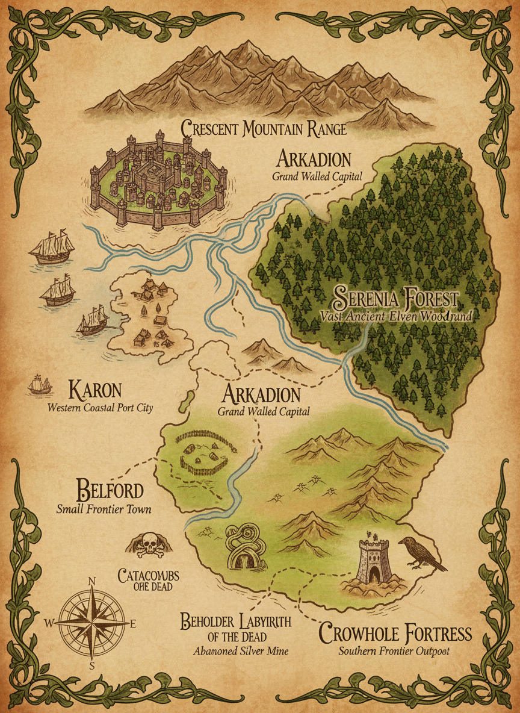

### 주요 지역

- **벨포드** — 모험의 시작점. 남부 초원 지대의 변방 도시
- **아르카디온** — 아르카디온 왕국의 수도. 세 강의 합류점
- **세레니아 숲** — 엘프 자치령. 고대 숲과 정령의 샘
- **카론** — 서해안 항구 도시. 대륙 간 교역의 거점
- **크레센트 산맥** — 북부 경계. 드워프 정착지가 산재
- **망자의 지하묘지** — 벨포드 남쪽 초중급 던전
- **비홀더의 미궁** — 남부 산악 지대의 미궁형 던전
- **크로우홀 요새** — 남부 변방 최전선. 바포메트 던전 입구
