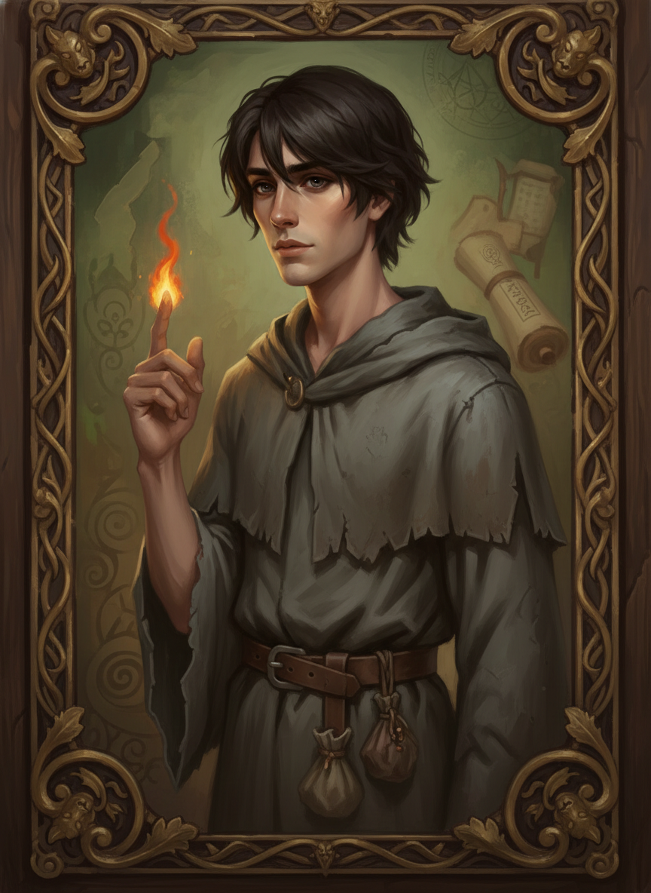
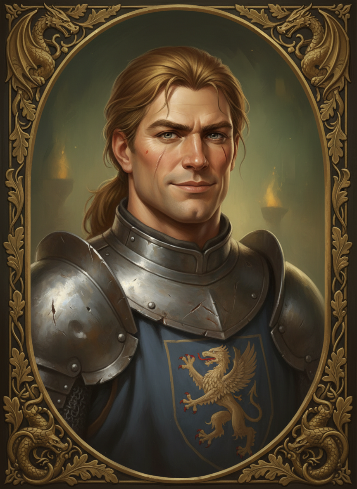
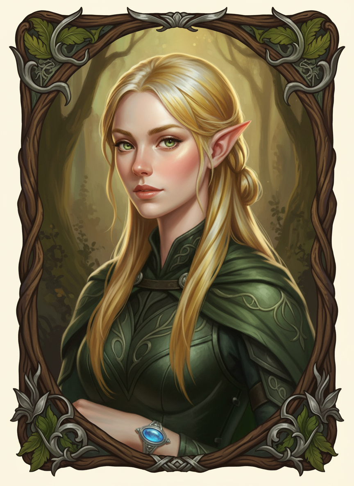
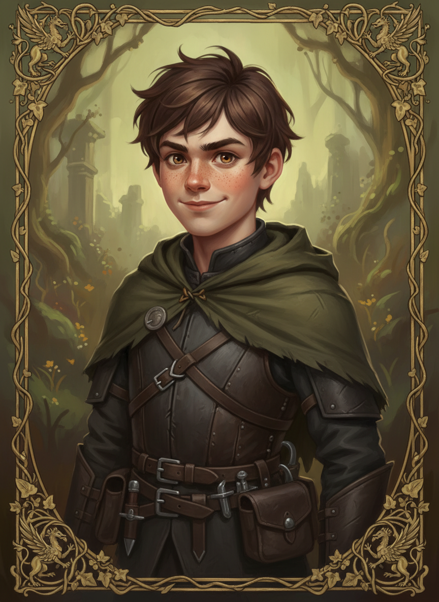

## 코어 파티

### 카이렌 아셀 (Kairen Asel)

- **종족**: 인간 | **직업**: 마법사 (뉴트럴)
- **나이**: 23세 | **등급**: F → (성장)
- 겉으로는 조용하지만 머릿속은 항상 폭풍. 분석형 후방 딜러 겸 전술가.

### 가렌 벨크로스 (Garen Belcross)

- **종족**: 인간 | **직업**: 기사 (로우풀)
- **나이**: 25세 | **등급**: E → (성장)
- 먼저 움직이고 나중에 생각한다. 전위 탱커이자 파티의 정신적 지주.

### 리에나 에란실 (Liena Eransil)

- **종족**: 엘프 | **직업**: 정령술사
- **나이**: 127세 (외견 23세) | **등급**: D (비공개)
- 냉정한 겉모습 아래 따뜻한 마음. 치유와 정령 마법의 전문가.

## 시즌1 주요 인물

### 테오 마르케스 (Theo Marques)

- **종족**: 인간 | **직업**: 도적 (카오틱)
- **나이**: 19세 | **등급**: F
- 자유분방한 쌍검사. EP010에서 합류. 밝은 겉모습 뒤에 고아 출신의 불안감이 숨어 있다.
